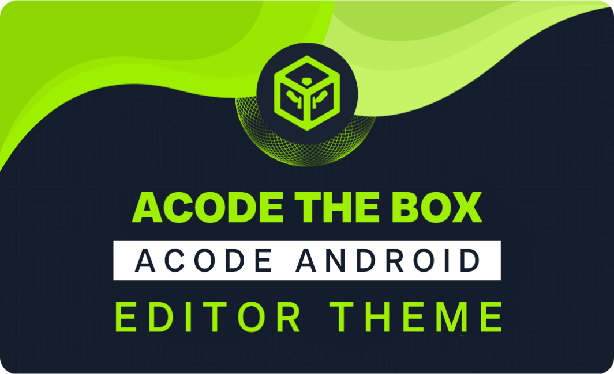

  

# Acode The Box Theme

Theme for ACODE reference from Hack The Box **[BY HACKERS](https://www.hackthebox.eu)**.  Theme with 7 color combinations that blend and suit your eyes.

  

# Beastly Color Contrast

  

# Theme Preview

This theme puts the focus on your code, no distractions or overly saturated colors that might look good in a preview, but in reality, burns your eyes after a day of coding.

  

  

  

# Getting started

You can install this theme through the [Acode Website](https://acode.app/)

1.  Open **plugin** sidebar panel in Acode.
2.  Search for `Acode The Box`
3.  Click **install** to install the theme
4.  Settings > Theme > Editor > **Acode The Box**
